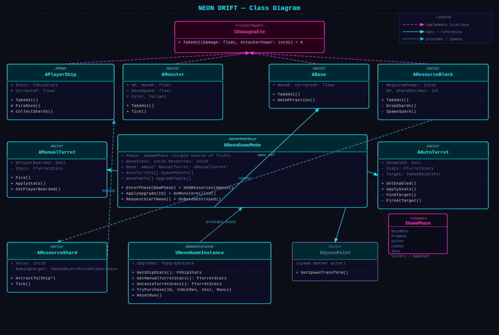

# NEON DRIFT

> 중력 없는 호버바이크로 자원을 긁어모으고, 사방에서 밀려오는 적을 막아내는 아케이드 웨이브 디펜스 게임.


UE 5.8 C++ 블랭크 템플릿에서 시작해 **3일 스프린트**로 완성한 웨이브 디펜스 프로젝트입니다.
입력 · UI · 머티리얼 제어까지 게임플레이 전체를 순수 C++로 작성해, CLI 빌드만으로 검증 가능한 구조를 목표로 했습니다.

🔗 **랜딩 페이지:** https://iamfreakin.github.io/NEON-DRIFT/

---

## 게임 플레이

**채집 → 전투 → 강화**가 맞물려 도는 루프를 5웨이브 동안 반복합니다.

| 단계 | 내용 |
|---|---|
| **GATHER** | 호버바이크로 비행하며 자원 블록을 파괴하고, 자석으로 부스러기를 흡수한다. |
| **COMBAT** | 기지 수동 포탑에 탑승해 N·E·S·W 입구로 밀려오는 적의 파도를 막아낸다. |
| **SHOP**   | 모은 자원으로 기체·포탑 8종 강화를 구매하고 다음 웨이브로 진입한다. |

## 핵심 메커닉

- **호버바이크 비행** — 중력 없는 6DOF 이동, 지수 감속(드래그)과 자동 호버. 속도에 따라 FOV가 70°→110°로 보간된다.
- **자석 자원 채집** — 파괴된 블록의 부스러기가 자석 범위 안에서 호밍 가속으로 빨려든다.
- **공격력 게이트 블록** — Gold·Iron·Diamond 3종. 기체 공격력이 블록의 RequiredPower에 못 미치면 파괴되지 않는다.
- **포탑 탑승 전투** — `E` 키로 수동 포탑 탑승. 회전 속도가 제한돼 조준에 무게감이 있다.
- **웨이브 디펜스** — 5웨이브 5/10/15/20/30마리, 후반엔 4방향 동시 스폰.
- **강화 상점** — 자석·공격력·속도·HP·포탑 회전·연사·자동포탑 수 등 통합 8종 강화.

## 조작법

| 키 | 동작 |
|---|---|
| `W` `A` `S` `D` | 기체 이동 |
| `Space` / `Ctrl` | 상승 / 하강 |
| `Mouse` | 시점 조준 |
| `좌클릭` | 발사 |
| `E` | 수동 포탑 탑승 / 해제 |
| `F` | 웨이브 준비 완료 |
| `↑` `↓` / `Enter` | 상점 항목 이동 / 구매 |
| `Tab` | 다음 웨이브 시작 |
| `R` | 재시작 |

## 기술 스택

- **Unreal Engine 5.8** · **C++20** · BuildSettingsVersion V7
- **Enhanced Input** — IMC/IA를 `.uasset` 없이 PlayerController에서 `NewObject` + `MapKey`로 코드 생성
- **Canvas HUD** — UMG 위젯 없이 `AHUD::DrawHUD()` 드로잉으로 자원·HP 바·웨이브·상점·포탑 조준점 구현
- **상태머신 게임 루프** — PreWave→Gather→Combat→Shop→Victory/GameOver 7상태 전이
- **IDamageable 인터페이스** — 블록·몬스터·기지가 공통 `TakeHit(Damage, AttackerPower)` 구현
- **Dynamic Material Instance** — 네온 색·발광·피격 플래시를 C++ MID 파라미터로 런타임 제어
- **Niagara** — 기체·몬스터 파티클 트레일

## 클래스 구조



| 계층 | 클래스 | 역할 |
|---|---|---|
| **Core** | `ANeonGameMode` | 게임 상태(Phase) 단일 소유, 웨이브·스폰·자원 관리 |
| **Core** | `UNeonGameInstance` | 웨이브 간 업그레이드 상태 영속 보관, 스탯 계산 |
| **Interface** | `IDamageable` | `TakeHit(Damage, AttackerPower)` — 블록·몬스터·기지·기체 공통 피해 수신 |
| **Player** | `APlayerShip` | 6DOF 비행, 자석 채집, 발사 — `IDamageable` 구현 |
| **Player** | `AManualTurret` | E키 탑승, 회전 캡 조준, 포탑 발사 |
| **Enemy** | `AMonster` | 목표 추적·공격, 웨이브 데이터로 스탯 주입 — `IDamageable` 구현 |
| **World** | `ABase` | 기지 HP 관리, 파괴 시 GameMode에 통보 — `IDamageable` 구현 |
| **Item** | `AResourceBlock` | 공격력 게이트, 파괴 시 `AResourceShard` 스폰 — `IDamageable` 구현 |
| **Item** | `AResourceShard` | `TWeakObjectPtr`로 기체를 향해 호밍 가속 |
| **Support** | `AAutoTurret` | 범위 내 적 자동 탐색·발사, 강화 상점으로 활성화 수 조절 |

## 프로젝트 구조

```
NEONDRIFT/
├─ Source/NEONDRIFT/      게임플레이 C++ 소스 (Public/ · Private/)
├─ Config/               프로젝트 설정 (DefaultEngine.ini 등)
├─ Content/              에셋 (레벨, 머티리얼)
├─ docs/                 기획서·발표자료·설계서 PDF + 랜딩 페이지
└─ NEONDRIFT.uproject
```

## 빌드 & 실행

```powershell
& "C:/Program Files/Epic Games/UE_5.8/Engine/Build/BatchFiles/Build.bat" `
  NEONDRIFTEditor Win64 Development `
  -Project="<경로>/NEONDRIFT.uproject" -WaitMutex
```

빌드 후 `NEONDRIFT.uproject`를 UE 5.8 에디터로 열고 PIE(Play In Editor)로 실행합니다.

## 문서

- [게임 기획서](docs/NEONDRIFT_기획서.pdf)
- [발표 자료](docs/NEONDRIFT_발표자료.pdf)
- [구현 설계서](docs/NEONDRIFT_설계서.pdf) — 아키텍처 · 클래스 · 데이터 테이블

---

© 2026 [iamfreakin](https://github.com/iamfreakin) · UE5 C++ Arcade Wave Defense
