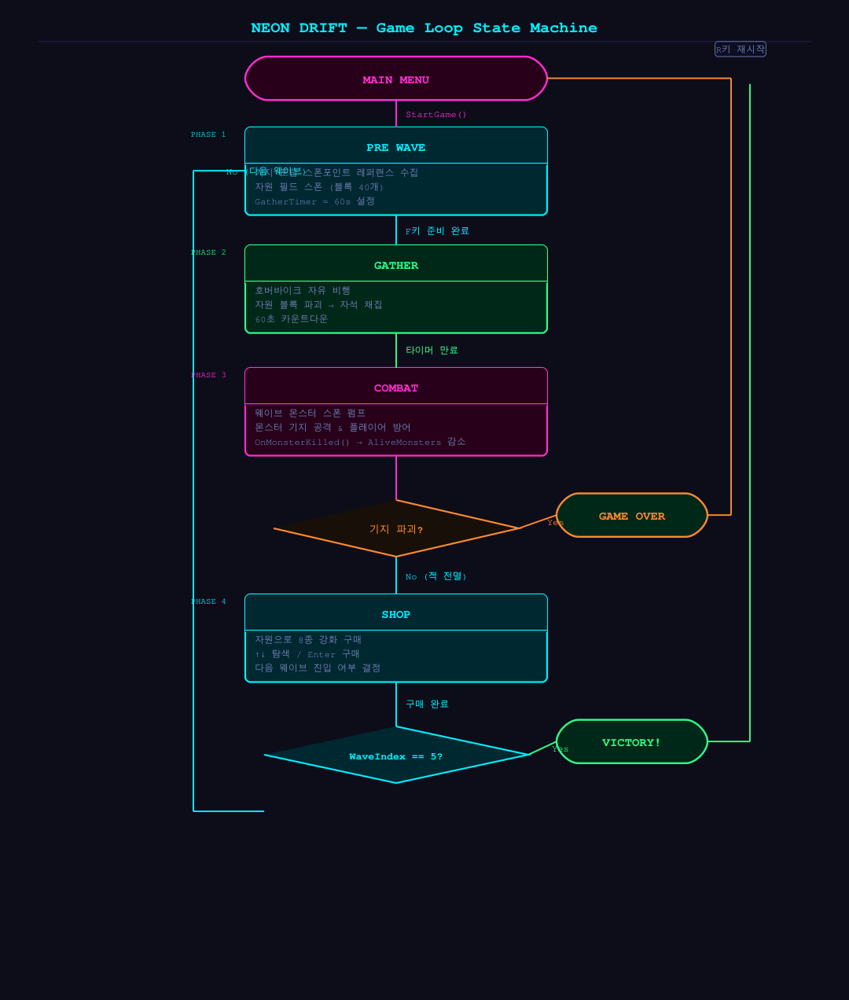
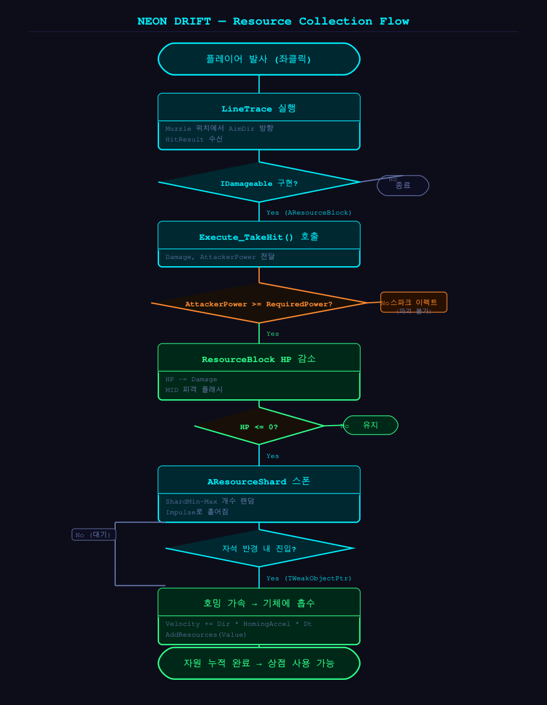
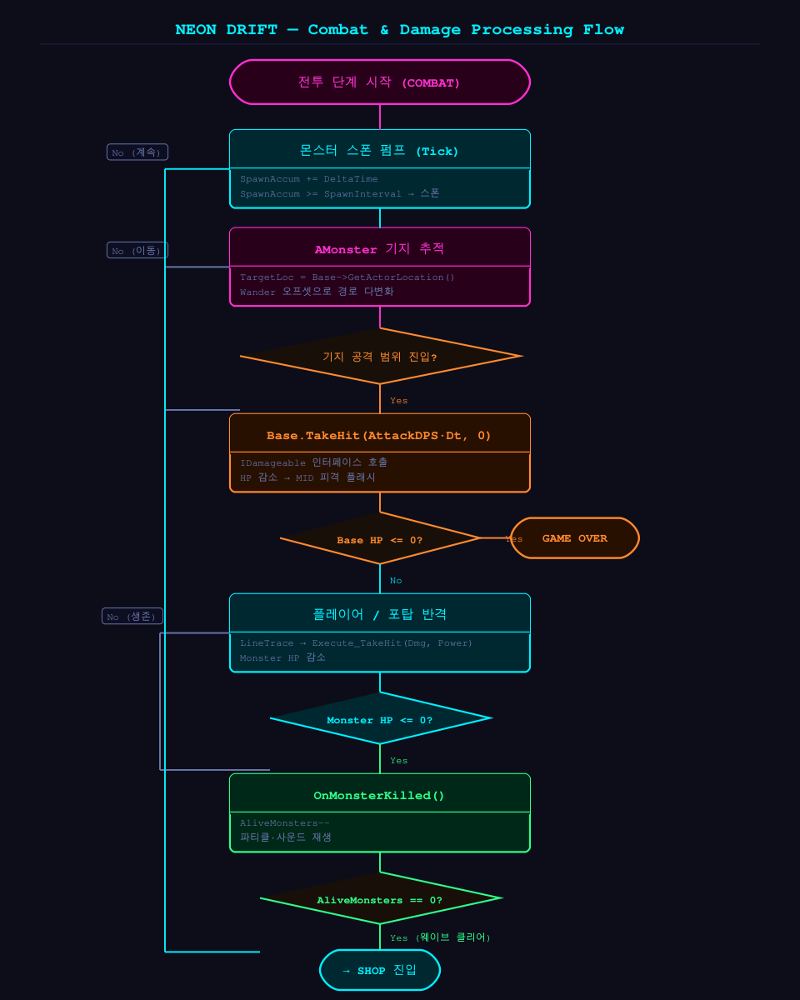

# NEON DRIFT

<div align="center">


**중력 없는 호버바이크로 자원을 긁어모으고, 사방에서 밀려오는 적을 막아내는 아케이드 웨이브 디펜스.**

UE 5.8 C++ 블랭크 템플릿에서 시작해 **3일 스프린트**로 완성. Blueprint 게임 로직 0%, 게임플레이 전체를 순수 C++로 작성했다.

[🌐 랜딩 페이지](https://iamfreakin.github.io/NEON-DRIFT/) · [📁 소스 코드](https://github.com/iamfreakin/NEON-DRIFT)

</div>

---

## 플레이 영상

<div align="center">


</div>

---

## 게임 루프

**채집 → 전투 → 강화**가 맞물려 도는 루프를 5웨이브 동안 반복한다.

| 페이즈 | 행동 | 조건 |
|---|---|---|
| **GATHER** | 호버바이크로 자원 블록 파괴, 자석으로 부스러기 흡수 | 60초 타이머 |
| **COMBAT** | 수동 포탑 탑승 → N·E·S·W 입구 몬스터 방어 | 전 몬스터 처치 |
| **SHOP** | 자원으로 기체·포탑 8종 강화 구매 | 다음 웨이브 진입 |

웨이브 구성: **5 / 10 / 15 / 20 / 30마리**, 후반엔 4방향 동시 스폰.

---

## 핵심 구현

### 상태머신 — GameMode Single Source of Truth

`ANeonGameMode`만 `Phase`를 소유한다. 다른 액터는 읽기만 하고 직접 변경하지 않는다.

```cpp
// NeonGameMode.h
EGamePhase Phase = EGamePhase::PreWave;  // 단 하나의 Phase 변수

void EnterPhase(EGamePhase NewPhase);    // 모든 전이는 여기만 통과
void OnMonsterKilled();                  // 전이 트리거 → EnterPhase 호출
void OnBaseDestroyed();
```

```
MainMenu → PreWave → Gather → Combat → Shop ─┬─→ PreWave (루프)
                                              └─→ Victory
                              └── 기지 파괴 → GameOver
```

---

### IDamageable 인터페이스 — 타입 캐스트 없는 피해 전달

라인트레이스가 맞은 액터에 인터페이스 캐스트 한 번으로 피해를 전달한다. `AResourceBlock`, `AMonster`, `ABase`, `APlayerShip` 모두 동일한 경로를 거친다.

```cpp
// NeonTypes.h
class IDamageable {
public:
    virtual void TakeHit(float Damage, int32 AttackerPower) = 0;
};

// PlayerShip.cpp  — 발사 시
if (IDamageable* Target = Cast<IDamageable>(HitResult.GetActor()))
    Target->TakeHit(Stats.AttackDamage, Stats.AttackPower);
```

---

### 프레임 독립 물리 — 지수 감속

`Velocity *= 0.95f`는 프레임레이트에 종속된다. 지수 함수로 감속하면 30fps·144fps 모두 동일한 비행감을 낸다.

```cpp
// PlayerShip.cpp — Tick
Velocity *= FMath::Pow(1.0f - Stats.LinearDrag, DeltaTime);
GetActorLocation() + Velocity * DeltaTime;
```

---

### Enhanced Input — 에셋 0개 코드 생성

`.uasset` 파일 없이 `PlayerController`에서 `InputMappingContext`와 `InputAction`을 런타임에 생성한다.

```cpp
// NeonPlayerController.cpp
auto* IMC = NewObject<UInputMappingContext>(this);
auto* IA_Move = NewObject<UInputAction>(this);
IA_Move->ValueType = EInputActionValueType::Axis2D;
IMC->MapKey(IA_Move, EKeys::W);
SubSystem->AddMappingContext(IMC, 0);
```

---

### TWeakObjectPtr — 댕글링 포인터 방어

`AResourceShard`는 기체가 사라진 뒤에도 Tick이 돌 수 있다. Raw 포인터 대신 `TWeakObjectPtr`로 유효성을 검사한다.

```cpp
// ResourceShard.h
UPROPERTY() TWeakObjectPtr<APlayerShip> HomingTarget;

// ResourceShard.cpp — Tick
if (HomingTarget.IsValid())
    Velocity += (HomingTarget->GetActorLocation() - Loc).GetSafeNormal()
                * HomingAccel * DeltaTime;
```

---

## 아키텍처


| 계층 | 클래스 | 역할 |
|---|---|---|
| **Core** | `ANeonGameMode` | Phase 단일 소유, 웨이브·스폰·자원 관리 |
| **Core** | `UNeonGameInstance` | 웨이브 간 업그레이드 상태 영속, 스탯 계산 제공 |
| **Interface** | `IDamageable` | `TakeHit(Damage, Power)` — 4개 클래스 공통 구현 |
| **Player** | `APlayerShip` | 6DOF 비행, 자석 채집, 발사 |
| **Player** | `AManualTurret` | E키 탑승, 회전 캡 조준 |
| **Enemy** | `AMonster` | 기지 추적·공격, 웨이브 데이터 주입 |
| **World** | `ABase` | 기지 HP, 파괴 시 GameMode 통보 |
| **Item** | `AResourceBlock` | 공격력 게이트, 파괴 시 Shard 스폰 |
| **Item** | `AResourceShard` | TWeakObjectPtr 호밍 가속 |
| **Support** | `AAutoTurret` | 자동 탐색·발사, 강화로 활성 수 조절 |

---

## 플로우차트

<details>
<summary>게임 루프 상태머신</summary>



</details>

<details>
<summary>자원 채집 흐름</summary>



</details>

<details>
<summary>전투 & 피해 처리 흐름</summary>



</details>

---

## 왜 Blueprint 없이?

> Blueprint는 빠른 프로토타이핑엔 강하지만, 로직이 노드 그래프로 분산되면 상태 추적이 어려워진다.
> 순수 C++로 작성하면 전체 게임 로직이 텍스트 파일 안에 있고, CLI 빌드 한 번으로 컴파일 오류를 검증할 수 있다.

- **에셋 0개 원칙** — Enhanced Input, HUD, 머티리얼 제어 전부 C++ 런타임 생성
- **단방향 의존** — 액터들은 GameMode를 참조하지만 GameMode가 액터를 직접 호출하는 경우를 최소화
- **CLI 검증** — UBT 빌드만으로 전체 게임 로직 컴파일 오류 확인 가능

---

## 조작법

| 키 | 동작 |
|---|---|
| `W` `A` `S` `D` | 기체 이동 |
| `Space` / `Ctrl` | 상승 / 하강 |
| `Mouse` | 시점 조준 |
| `좌클릭` | 발사 |
| `E` | 수동 포탑 탑승 / 해제 |
| `F` | 웨이브 준비 완료 |
| `↑` `↓` / `Enter` | 상점 항목 이동 / 구매 |
| `R` | 재시작 |

---

## 빌드

```powershell
& "C:/Program Files/Epic Games/UE_5.8/Engine/Build/BatchFiles/Build.bat" `
  NEONDRIFTEditor Win64 Development `
  -Project="<경로>/NEONDRIFT.uproject" -WaitMutex
```

빌드 후 `NEONDRIFT.uproject`를 UE 5.8 에디터로 열고 PIE(Play In Editor)로 실행.

---

## 문서

| | |
|---|---|
| [게임 기획서](docs/NEONDRIFT_기획서.pdf) | 기획 의도 · 규칙 · 밸런스 |
| [발표 자료](docs/NEONDRIFT_발표자료.pdf) | 프로젝트 발표 슬라이드 |
| [구현 설계서](docs/NEONDRIFT_설계서.pdf) | 아키텍처 · 클래스 · 데이터 테이블 |

---

<div align="center">

© 2026 [iamfreakin](https://github.com/iamfreakin) · UE5 C++ Arcade Wave Defense · 3-Day Sprint

</div>
