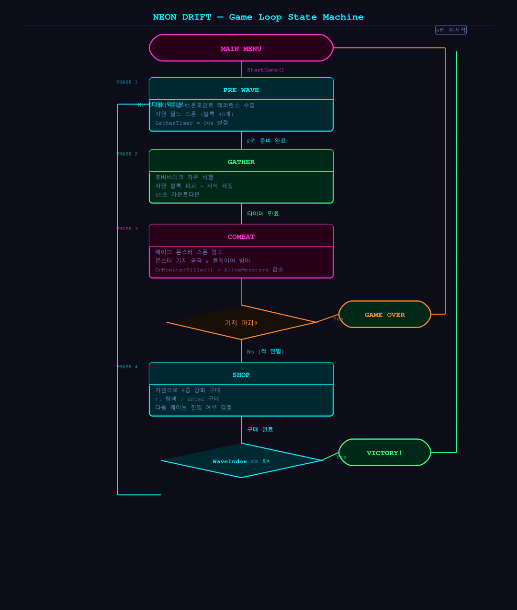
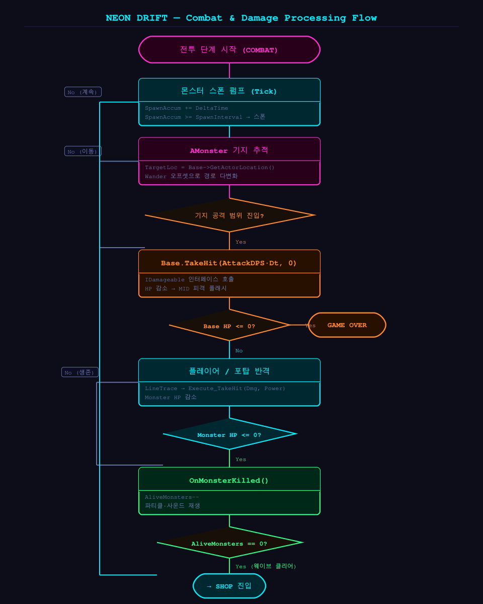
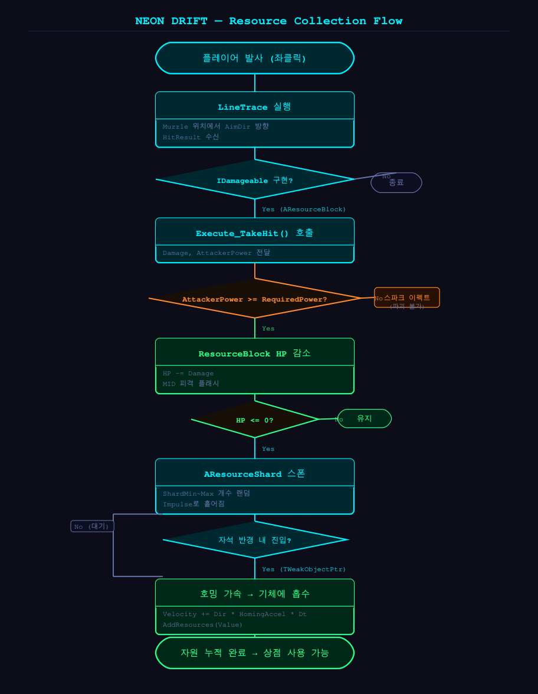
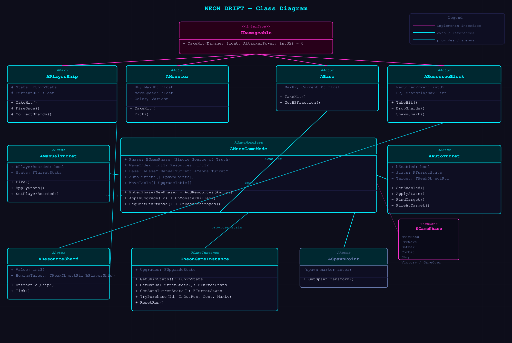

# NEON DRIFT — 중력 없는 아케이드 웨이브 디펜스

3일 안에 채집, 전투, 강화, 승패 판정까지 이어지는 게임 루프를 Unreal C++ 중심으로 닫은 3D 아케이드 웨이브 디펜스 프로젝트입니다.

[랜딩 페이지](https://iamfreakin.github.io/NEON-DRIFT/) | [소스 코드](https://github.com/iamfreakin/NEON-DRIFT) | [Portfolio Hub](https://github.com/iamfreakin/GamePortfolio) | [구현 설계서](docs/NEONDRIFT_설계서.pdf) | [게임 기획서](docs/NEONDRIFT_기획서.pdf) | [실행 파일 다운로드](https://drive.google.com/file/d/1C71W51GIf9KWpUrPd3QW4Mcj6TCb8lJ-/view?usp=sharing)

## Overview

| 항목 | 내용 |
| --- | --- |
| 장르 | 3D 아케이드 웨이브 디펜스 |
| 엔진/언어 | Unreal Engine 5.8, C++20 |
| 개발 형태 | 1인 개발 |
| 개발 기간 | 3일 |
| Repository | [iamfreakin/NEON-DRIFT](https://github.com/iamfreakin/NEON-DRIFT) |

UE 5.8 C++ Blank Template에서 시작해 3일 안에 채집 → 전투 → 강화로 이어지는 게임 루프 전체를 완성했습니다. 기능을 많이 시작하기보다 하나의 루프를 끝까지 구동 가능한 결과물로 만드는 것을 목표로 했습니다.

## Gameplay Preview

### 시작 화면

### 공중 전투

### 수동 터렛 전투

### 터렛 조작

### 자원 회수

### 상점 강화

## Problem

짧은 기간 프로젝트에서 가장 큰 위험은 기능을 많이 시작하고 아무것도 끝내지 못하는 것입니다. 전투, 자원, 상점이 따로 존재해도 승패 판정까지 이어지지 않으면 완성 루프라고 보기 어렵습니다.

## Implementation

게임 흐름을 `MainMenu`, `PreWave`, `Gather`, `Combat`, `Shop`, `GameOver`, `Victory`의 7단계 상태로 나누고 GameMode에서 전이와 승패 조건을 관리했습니다.

전투 대상은 `IDamageable` 인터페이스로 묶어 몬스터, 기지, 자원 블록을 같은 피해 처리 구조에 연결했습니다. 상점 입력 문제는 UMG 포커스 트리 우회가 아니라 Canvas HUD 직접 렌더링으로 입력 경로를 단순화해 해결했습니다.

## Key Features

1. **7단계 상태머신**  
   `MainMenu`, `PreWave`, `Gather`, `Combat`, `Shop`, `GameOver`, `Victory`로 게임 흐름을 분리했습니다.

2. **IDamageable 인터페이스**  
   몬스터, 기지, 자원 블록처럼 서로 다른 피격 대상을 하나의 피해 처리 계약으로 묶었습니다.

3. **Blueprint 0% 코드베이스**  
   Enhanced Input, HUD, 게임 로직을 C++ 중심으로 구성해 변경사항을 코드 diff로 추적할 수 있게 했습니다.

4. **Canvas HUD 기반 상점 UI**  
   UMG 포커스 충돌 대신 Canvas HUD 직접 렌더링으로 입력 경로를 단순화했습니다.

## Architecture

### Game Loop

### Combat Flow

### Resource Flow

### Class Diagram

## My Contribution

- C++ 클래스 설계 및 전체 구현
- 상태머신(GameMode), 6DOF 비행 물리(PlayerShip), 자원 채집 자석(ResourceShard), 포탑 탑승/조준(ManualTurret), HUD 구현
- Gather, Combat, Shop, Victory/GameOver로 이어지는 닫힌 게임 루프 연결
- `IDamageable` 기반 피해 처리 구조 적용
- 3일 개발 기간에 맞춘 기능 범위 조절
- 구현 설계서, 기획서, 발표 자료 정리

## Technical Challenge

상점 진입 시 방향키와 Enter 입력이 게임 로직에 전달되지 않는 문제가 있었습니다. 원인은 `PlayerController -> Enhanced Input` 경로와 `UMG 위젯 포커스 트리` 경로가 분리되어 있고, UI 모드에서 위젯 경로가 키 이벤트를 선점한 것이었습니다.

임시 패치 대신 상점 UI를 Canvas HUD 직접 렌더링으로 교체하고 `FInputModeGameOnly()`를 유지했습니다. 입력이 PlayerController 한 경로만 통과하도록 정리해 충돌 구조를 제거했습니다.

## Tech Stack

| 영역 | 내용 |
| --- | --- |
| Engine | Unreal Engine 5.8 |
| Language | C++20 |
| Input | Enhanced Input System |
| UI | Canvas HUD |
| Build | Unreal Build Tool |

## Controls

| 키 | 동작 |
| --- | --- |
| `W` `A` `S` `D` | 기체 이동 |
| `Space` / `Ctrl` | 상승 / 하강 |
| `마우스` | 시점 조준 |
| `좌클릭` | 발사 |
| `E` | 수동 포탑 탑승 / 해제 |
| `F` | 웨이브 준비 완료 |
| `↑` `↓` / `Enter` | 상점 항목 이동 / 구매 |
| `R` | 재시작 |

## Build

1. Unreal Engine 5.8 설치
2. `NEONDRIFT.uproject` 우클릭 후 Generate Visual Studio project files 실행
3. `Build.bat NEONDRIFTEditor Win64 Development -Project="<경로>/NEONDRIFT.uproject"` 실행
4. Unreal Editor에서 PIE 실행

## Documents

- [구현 설계서](docs/NEONDRIFT_설계서.pdf): 아키텍처, 클래스 구조, 트러블슈팅
- [게임 기획서](docs/NEONDRIFT_기획서.pdf): 기획 의도, 규칙, 밸런스
- [발표 자료](docs/NEONDRIFT_발표자료.pdf): 발표 슬라이드

---

© 2026 [iamfreakin](https://github.com/iamfreakin) · UE5 C++ Arcade Wave Defense · 3-Day Sprint

